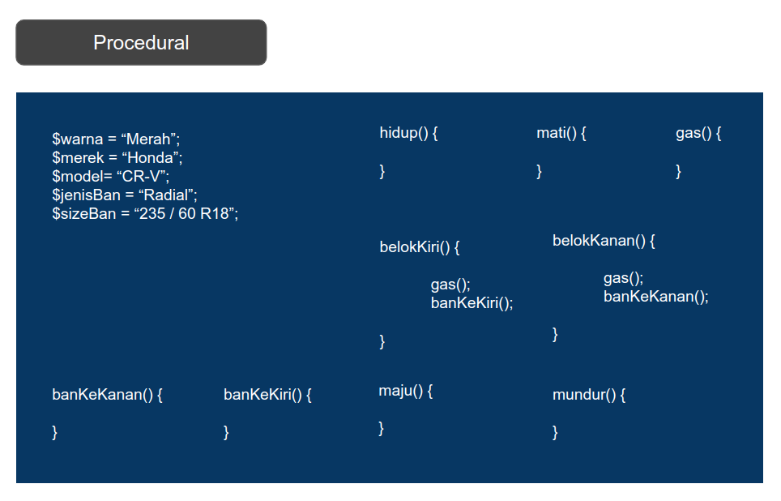
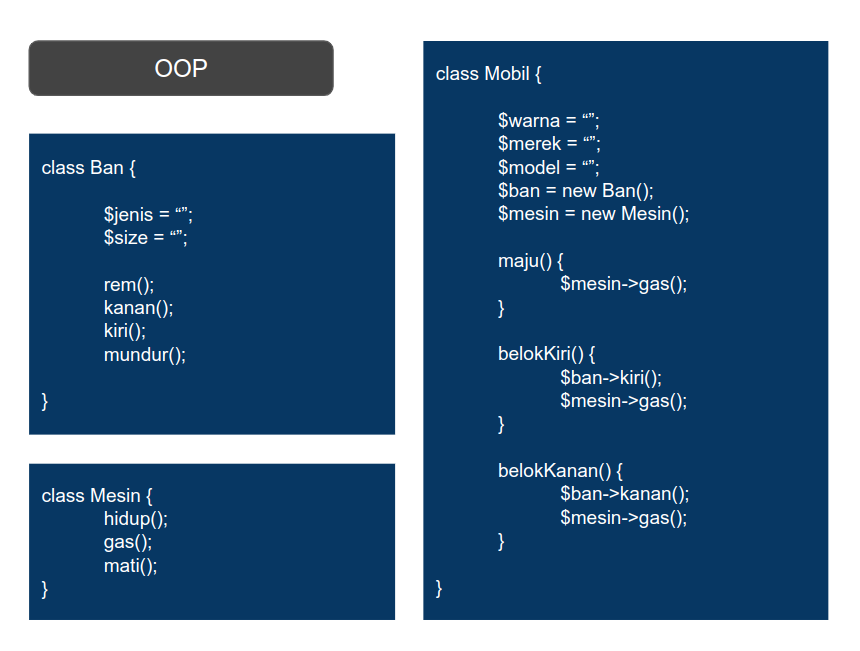
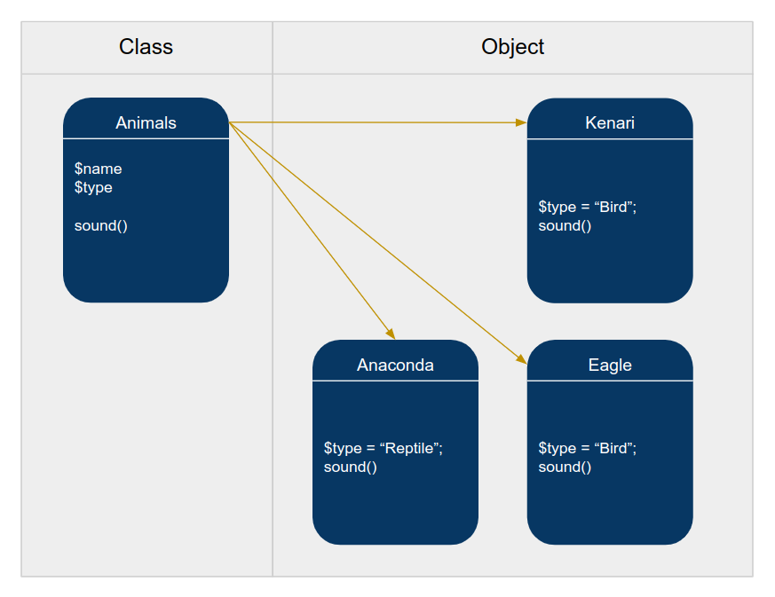
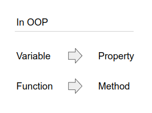
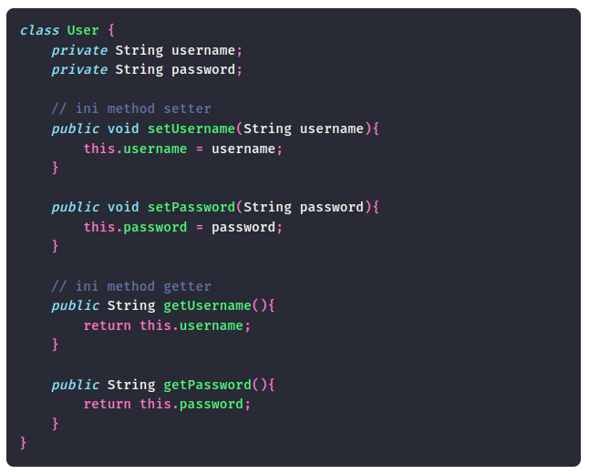
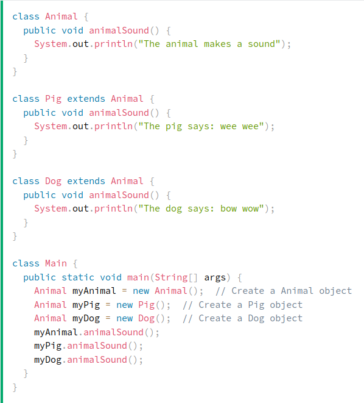

# Java OOP
Object Oriented Programming in Java

## # Why OOP?

Because with the procedural, if the program is getting bigger and more complex it will be difficult to maintain.

- Organized syntax
- Effective and efficient
- Saving time
- Easy to develop
- Quickly detect and fix bugs
- Avoid conflicts in naming variables and functions

## # What is OOP?

An object-oriented programming paradigm or technique that can contain interacting functions and variables.

## # Object is

The real or concrete result of the class. In other words, an object is an instance of a class.

## # Class is

The blueprint of the object.

## # Inheritance

Overriding

## # Encapsulation

Make sure that "sensitive" data is hidden from users

## # Modifiers

### Access Modifiers
For classes: *public, default*

For attributes, methods and constructors: *public, private, default, protected*

### Non-Access Modifiers

For classes: *final, abstract*

For attributes and methods: *final, static, abstract, transient, synchronized, volatile*

## # Constructor

The constructor is called when the object is created.

The constructor name must match the class name, and it cannot have a return type (like void).

*All classes have constructors by default: if you do not create a class constructor yourself, Java creates one for you. However, then you are not able to set initial values for object attributes.*

## # Setter & Getter Methods

Setter and getter methods are two methods used to retrieve and fill data into objects.

## # Polymorphism

Polymorphism means "many forms", and it occurs when we have many classes that are related to each other by inheritance.

Inheritance lets us inherit attributes and methods from another class. Polymorphism uses those methods to perform different tasks.

*Source by w3schools.com*